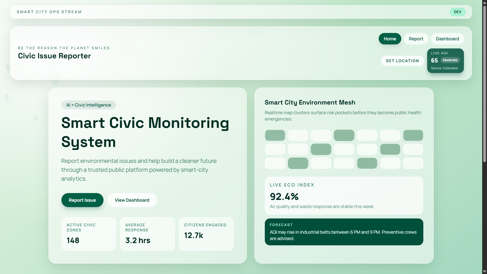
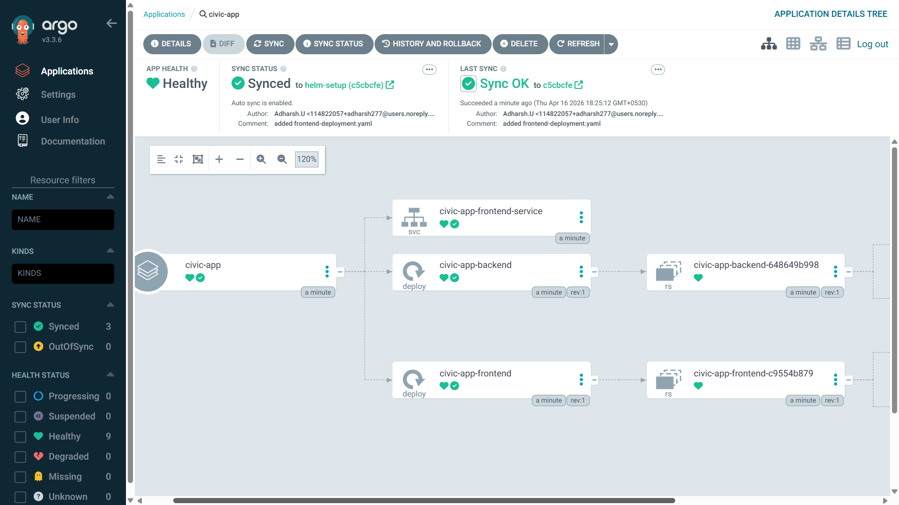
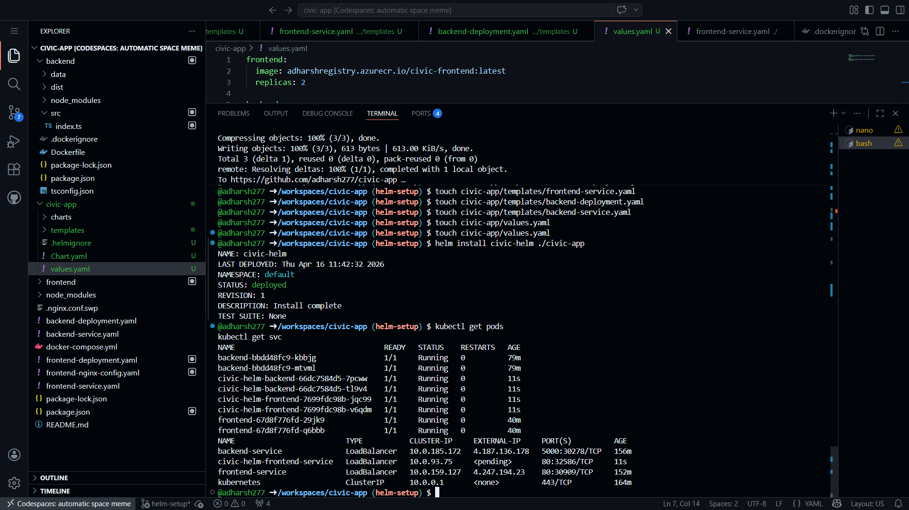
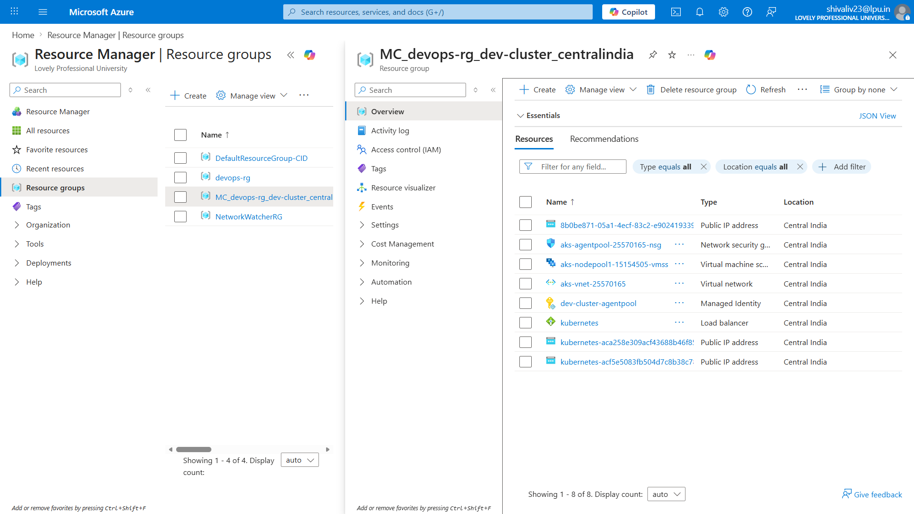

# Civic App

Full-stack civic issue reporting platform with a React frontend, Node.js backend, SQLite persistence, containerization, Kubernetes manifests, Helm packaging, and Argo CD GitOps support for Azure AKS.

### Frontend



## What This Project Does

Citizens can submit public issue reports (garbage, road, water) with location and details.

Admins can:

- log in with state-level credentials,
- view reports from their assigned state,
- update issue status (`Pending`, `In Progress`, `Resolved`).

The app is designed to run in multiple ways:

- local development (`npm run dev`)
- Docker Compose
- Kubernetes manifests
- Helm chart
- Argo CD GitOps (ideal for AKS/Azure)

## How It Works

1. User opens frontend and submits a report.
2. Frontend sends request to backend API.
3. Backend validates data and stores it in SQLite (`backend/data/civic.db`).
4. Admin logs in and receives a token.
5. Admin reads and updates reports scoped to the admin's state.
6. Frontend reflects updated report status.

## Architecture

```text
User Browser
		|
		v
Frontend (React + Vite + Nginx)
		|
		v
Backend API (Node.js + Express)
		|
		v
SQLite Database (better-sqlite3)

Deployment options:
- Local (Node + Vite)
- Docker Compose
- Kubernetes (Deployments + Services + ConfigMap)
- Helm chart (civic-app/)
- Argo CD sync from Git (GitOps)
```

## Tech Stack

### Frontend

- React 19
- TypeScript
- Vite
- React Router
- Axios
- Tailwind CSS (dependency included)
- Nginx (container runtime)

### Backend

- Node.js
- Express 5
- TypeScript
- better-sqlite3 (SQLite)
- CORS

### DevOps and Cloud

- Docker and Docker Compose
- Kubernetes
- Helm 3
- Argo CD
- Azure Container Registry (ACR)
- Azure Kubernetes Service (AKS)

## Repository Structure

```text
.
├── backend/
│   ├── src/index.ts
│   ├── data/
│   └── Dockerfile
├── frontend/
│   ├── src/
│   ├── nginx.conf
│   └── Dockerfile
├── civic-app/                 # Helm chart
│   ├── Chart.yaml
│   ├── values.yaml
│   └── templates/
├── backend-deployment.yaml    # Raw Kubernetes manifests
├── backend-service.yaml
├── frontend-deployment.yaml
├── frontend-service.yaml
├── frontend-nginx-config.yaml
└── docker-compose.yml
```

## Prerequisites

Install these tools before setup:

- Node.js 18+ (Node 20 recommended)
- npm 9+
- Docker
- kubectl
- Helm 3
- Optional for Azure: Azure CLI (`az`)
- Optional for GitOps: Argo CD CLI (`argocd`)

## 1) Local Development Setup

### Run Full Stack from Root

```bash
npm install
npm run install:all
npm run dev
```

Services:

- Backend: `http://localhost:5000`
- Frontend: `http://localhost:5173`

### Run Individually

Backend:

```bash
cd backend
npm install
npm run dev
```

Frontend:

```bash
cd frontend
npm install
npm run dev
```

## 2) Docker Compose Setup

From repository root:

```bash
docker compose up --build
```

Service:

- Frontend via Nginx: `http://localhost:3000`

Stop:

```bash
docker compose down
```

## 3) Kubernetes Setup (Raw Manifests)

Apply manifests:

```bash
kubectl apply -f frontend-nginx-config.yaml
kubectl apply -f backend-deployment.yaml
kubectl apply -f backend-service.yaml
kubectl apply -f frontend-deployment.yaml
kubectl apply -f frontend-service.yaml
```

Check resources:

```bash
kubectl get pods
kubectl get svc
```

## 4) Helm Setup

Install chart from repo root:

```bash
helm install civic-release ./civic-app
```

Upgrade after changes:

```bash
helm upgrade civic-release ./civic-app
```

Uninstall:

```bash
helm uninstall civic-release
```

## 5) Argo CD GitOps Setup (Recommended for AKS)

### Install Argo CD (if not installed)

```bash
kubectl create namespace argocd
kubectl apply -n argocd -f https://raw.githubusercontent.com/argoproj/argo-cd/stable/manifests/install.yaml
```

### Create Argo CD Application

Save as `argocd-application.yaml`:

```yaml
apiVersion: argoproj.io/v1alpha1
kind: Application
metadata:
	name: civic-app
	namespace: argocd
spec:
	project: default
	source:
		repoURL: https://github.com/adharsh277/civic-app.git
		targetRevision: helm-setup
		path: civic-app
	destination:
		server: https://kubernetes.default.svc
		namespace: default
	syncPolicy:
		automated:
			prune: true
			selfHeal: true
```

Apply:

```bash
kubectl apply -f argocd-application.yaml
```

Argo CD will watch Git and sync Kubernetes automatically.

## 6) Azure Deployment Flow (ACR + AKS)

High-level flow:

1. Build frontend and backend images.
2. Push images to Azure Container Registry.
3. Update image tags in Helm values.
4. Argo CD syncs updated chart to AKS.

### Example Commands

```bash
# Login
az login

# Build and push backend
docker build -t <acr-name>.azurecr.io/civic-backend:latest ./backend
docker push <acr-name>.azurecr.io/civic-backend:latest

# Build and push frontend
docker build -t <acr-name>.azurecr.io/civic-frontend:latest ./frontend
docker push <acr-name>.azurecr.io/civic-frontend:latest
```

Then update `civic-app/values.yaml` images to point to ACR.

## Environment Configuration

Frontend API base URL:

- The client reads `VITE_API_BASE_URL`.
- If not set, frontend uses `/api` and expects Nginx/Kubernetes proxy routing.

Backend default port:

- `5000`

## API Endpoints

### Public

- `POST /report` submit issue report
- `GET /reports` list all reports
- `GET /health` health check

### Admin

- `POST /admin/login` admin authentication
- `GET /admin/reports` state-scoped report list
- `PATCH /admin/reports/:id/status` state-scoped status update

### Generic Status Update

- `PATCH /reports/:id/status`

## Default Admin Accounts

Seeded in backend startup:

- `delhi_admin / admin123`
- `kerala_admin / admin123`
- `maharashtra_admin / admin123`
- `punjab_admin / admin123`

## Screenshots

Add screenshots to `docs/screenshots/` and keep these names for auto-display.


### Argo CD



### Kubernetes (kubectl or dashboard)



### Azure (AKS or ACR view)



## Troubleshooting

- If frontend cannot reach backend, verify proxy route and service names.
- If Kubernetes image pull fails, check ACR credentials and image paths.
- If Argo CD shows OutOfSync, inspect app events and sync manually.
- If backend data seems missing, remember SQLite file is local to container unless persistent volume is configured.

## Next Improvements

- Add persistent volume for SQLite in Kubernetes.
- Add ingress + TLS for production domain.
- Add monitoring with Prometheus/Grafana.

---


